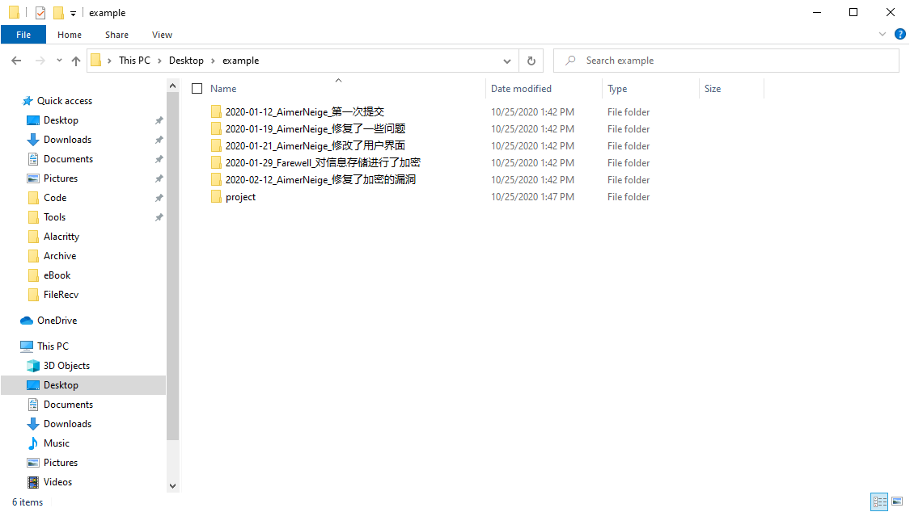

# Git & GitHub 入门教程

记得之前看过一篇文章，[《关于计算机科学的50个误解》](http://www.ruanyifeng.com/blog/2019/11/50-cs-falsehoods.html)，这篇文章中提到这样一个误解：

> git 和 GitHub 是同义词。

虽然这篇文章把 `git` 和 `GitHub` 放在了一起，但是它们并不是一个东西，接下来我会分别介绍它们。

## Git

### Git 是什么

如果你去查资料，你会发现 Git 是一个 **分布式版本控制软件** 光看这个定义我想你并不能理解到底什么是 git ，不过不用担心，接下来我会让你理解它。

先把这个奇怪的定义放一边吧，我们设想一种情境

假如你正在开发一个项目，在开发过程中，你发现单纯的更新日志已经不能满足你的需求，你想不仅想要记录每一次更新中更改的内容，而且希望可以在未来随时查看之前的代码。你会怎么做呢？

最简单的方法就是直接将整个项目文件夹复制一份，并且将文件夹进行规范化的命名。比如我们可以在修改完成后将整个项目复制到名为“修改日期-修改人-修改内容”的文件夹中，以后需要的话可以直接打开旧版本的文件夹，将文件复制出一份进行修改。

就像这样：

但是这样会有很多问题

1. 你的文件目录会很乱
2. 大量重复文件，浪费电脑存储空间
3. 难以进行多人协作

而 git 就是用来解决这些问题的。它可以进行版本控制，记录你的修改内容，可以随时回退版本，并且有良好的多人协作支持。

那么什么是分布式呢？相对与分布式的，是集中式。对比起来更容易理解，先说集中式版本控制系统：

集中式版本控制系统的版本库是集中存放在中央服务器的，也就是整个项目的所有文件都不是保存在你的电脑上，而是保存在服务器上，而我们需要进行开发的时候，我们不可能使用服务器来开发，我们都是使用自己的电脑，所以我们必须先从服务器下载到最新的版本，然后进行修改，修改完后，再把自己的修改推送给中央服务器。中央服务器就好比是一个图书馆，你要改一本书，必须先从图书馆借出来，然后回到家自己改，改完了，再放回图书馆。

看起来很不错，但是仔细想想就会发现一个很严重的问题：如果没有网络，就无法获取最新的版本，也就没有办法进行开发，即使获取到了最新的版本，没有网络也无法将本地的修改推送到服务器上，也就是说，离开网络，完全没有办法进行工作。如果是局域网还可以接受，毕竟局域网带宽够大，速度够快，但是如果在互联网上，遇到网速慢的话，可能需要消耗大量的时间在文件传输上，十分浪费时间

那什么是分布式呢？首先，分布式版本控制系统没有“中央服务器”的概念，每个人的电脑上都是一个完整的版本库，也就是拥有完整的历史记录，这样，在工作的时候，就不需要联网了，因为版本库就在自己的电脑上。那么如何解决协作问题呢？实际上很简单，比如你修改了A文件，你的同事也修改了A文件，你们只需要将修改的内容推送给对方就可以了。

和集中式版本控制系统，分布式版本控制系统的安全性更高，因为每个人电脑里都有完整的版本库，如果一个人的电脑坏了，没关系，只需要重别人那里复制一个就可以了。但是集中式版本控制系统的中央服务器一旦出了问题，所有人都没有办法工作了。

在实际使用分布式版本控制系统的时候，其实很少在两人之间的电脑上推送版本库的修改，因为可能你们俩不在一个局域网内，两台电脑互相访问不了，也可能今天你的同事病了，他的电脑压根没有开机。因此，分布式版本控制系统通常也有一台充当“中央服务器”的电脑，但这个服务器的作用仅仅是用来方便“交换”大家的修改，相当与一个共享网盘，没有它大家也一样可以进行工作，只是交换修改不方便而已。

## GitHub

